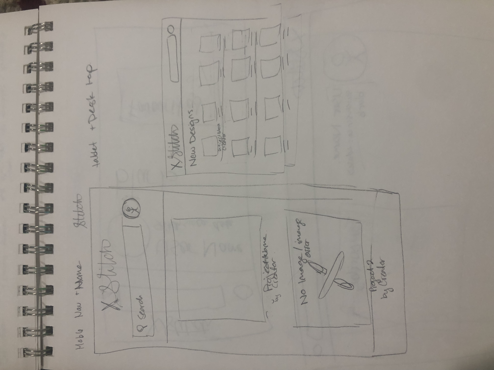
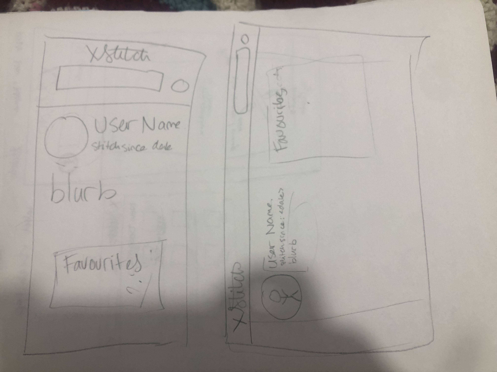
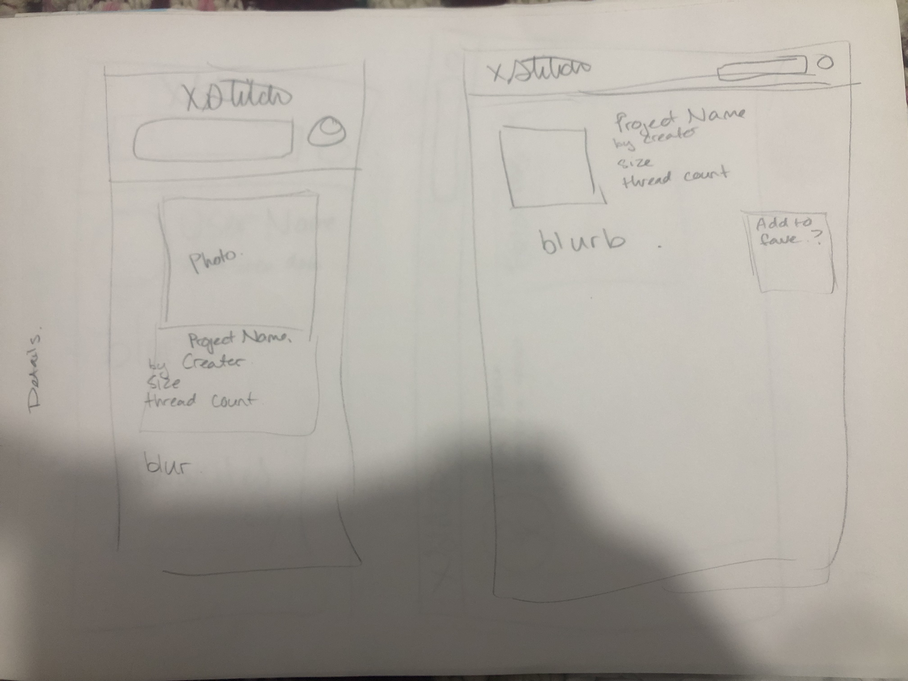
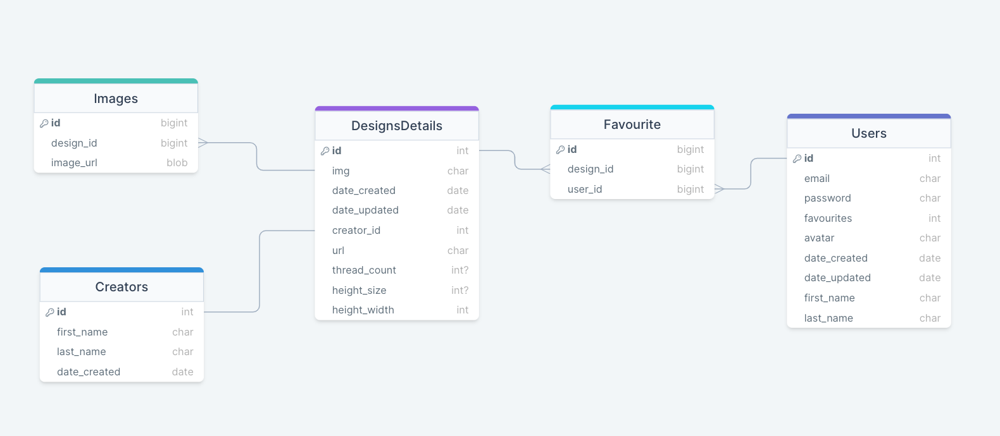

# Project Title

## Overview

X Stitch is a social cataloging website that would provide a centralized space for cross stitch enthusiasts to find new designs and share their work. For the sake and scope of this project I'm plannig to use antique and public domain patterns.

<!-- https://www2.cs.arizona.edu/patterns/weaving/topic_crossstitch.html -->
<!-- https://www.antiquepatternlibrary.org/html/warm/xstitch.htm -->
<!-- https://patternmakercharts.blogspot.com/2011/12/sajou-no-307.html -->

### Problem

I have been insterested in cross stitch for a while but have found it difficult to find designs that I like. Adding to this difficulty is the fact that individuals on sites like etsy will take advantage of new hobbiests to sell poorly made designs that may not even match their provided mock-ups. Ispired by websites like GoodReads, Letterboxd and Ravelry, a central social media site would have potential uses.

### User Profile

*Who will use your app? How will they use it?*
Cross Stitch enthusiasts could use it as a database to search through designs and find artists they like or art styles that fit their needs.

*Any special considerations that your app must take into account.*
Not that I can think of

### Features

- Logo should take the user back home
    -  A Home page with a list of the newest 15 designs on display 
- A search bar to look up specific content
    - A search page that will pull up designs that match search terms
- Avatar what will take their use to their account
    - User page that has a list of save projects
    - Edit and delete user Modals
    - Logout button
- When clicking on a design it should go to a page that provides details on the design:
    - (colours, size, description, creator, pushlished date, images array)
    - the ability to favourite a project (only for logged in users)
- Log-in and create accounts Modals

## Implementation

### Tech Stack

- React
- MySQL
- Express
- Client libraries: 
    - react
    - react-router-dom
    - axios
    - react-modal
    - react-multi-carousel
- Server libraries:
    - knex
    - express
    - cors/typescript
    - dotenv
    - nodemon
    - multer
    - mysql2
    - jsonwebtoken
    - bcryptjs

### APIs

No external APIs for this project

### Sitemap

- User page
    - in User Page: edit and delete modals
- Home page
- Search page
- Design detail page
- Sign in/Sign up Modals

### Mockups

### Data

# Endpoints

List endpoints that your server will implement, including HTTP methods, parameters, and example responses.

## GET:
### designs list
        - /designs
        - params: renders on homepage load
        - response (set limit to 10/15):

"   
    [{
        "id": 1,
        "design_name": "Cool Design",
        "creator_name": "Jane Doe"      
        "image": [{
            "design_id": 1,
            "id": 1, 
            "image_url": "http://localhost:8080/designs/design1.png"
        }]
    }]
"

### user data
    - /user
    - params: token
    - response:
"
    [{
        "avatar": "image1.jpg",
        "created_at": "2024-04-01T01:08:50.000Z",
        "email": "email@email.com"
        "id": 1,
        "first_name": "Joe",
        "last_name": "Smirth",
    }]
"

### design details 
    - /designs/details/:id
    - params: design id, token
    - response:
"   
    [{
        "created_at": "2024-04-01T01:08:50.000Z",
        "creator_name": "Jane Doe",
        "description": "I am describing this image",
        "design_name": "Cool Design",
        "favourites": false,
        "id": 1,
        "size_height": "16",
        "size_width": "16",
        "thread_count": "4"
        "image": [{
            "design_id": 1,
            "id": 1, 
            "image_url": "http://localhost:8080/designs/design1.png"
        }],  
    }]
"

### user favourites list
    - /user/:id
    - params: user id
    - response:
"
    [{
        "creator_name": "John Smith",
        "design_name": "border grapes",
        "id": 2,
        "image": [{
            "design_id": 2, 
            "id": 3,
            "image_url": "http://localhost:8080/designs/design3.png"
        }]
    }]
"

## POST:
### create user
     - /user/newUser
        - params: email, username, first_name, last_name, password, confirm_password, avatar
        - response:

    [{
       "Registered successfully"
    }]

### log-in user 
    - /user/login 
    - params: email, password
    - response:
 
    [{
    "token": "token"
    }]

### (login) add to favourites
    - /users/:id/favourites/:id
    - params: user id, token, favourites id
    - response:

    [{
        "favourite added"
   }]

## DELETE:
### (login) delete from favourites
    - /user/:id/favourites/:id
    - params: user id, favourites id, token
    - response:

    [{
        "favourite deleted"
    }]

### (login) delete user
    - /user/:id
    - params: user id
    - response:

    [{
        "User deleted"
    }]

## PATCH:
### edit user
    - /user/:id
    - params: id, avatar, first_name, last_name, email, password, confirm_password
    - response:

    [{
        "id": 1,
        "first_name": 'Joe',
        "last_name:" 'Smith',
        "email": 'email@email.com',
        "avatar": 'avatar1.png',
        "updated_at": '2024-04-01T02:18:44.000Z'
    }]

# Auth

JWD token authentication for logging in and accessing favourites

## Roadmap

- create client
    - routes & pages
        - pages: HomePage, DetailsPage, UserPage
        - cd routes: "/", "/:itemID", "/:userID"
        - user-password: "pass"

- create serve
    - routes, controllers

- create migration

- create seed
    - create 20 x stitch designs
    - create 1 user

- feature-layout
    - front end:
        - set up sass: mixins, variables, typography, global styling
        - create header & nav bar
        - create footer
    
- feature-homepage
    - frontend: 
        - create page components (similar to mock up)
            - cross stitch card with data filled - .map
    - backend:
        - .get /design

- features-signin-signup-page/modal
    - frontend: 
        - create modals for signing in and signing up
        - include forms - sign up must be able to take an image in avatar
    - backend:
        - .post /user/login & .post /user/newuser
        - JWT token auth

    sources to help with image uploading:
    <!-- https://stackoverflow.com/questions/4007969/application-x-www-form-urlencoded-or-multipart-form-data -->
    <!-- https://www.youtube.com/watch?v=dLXSJdTK9QI -->
    <!-- https://medium.com/ecmastack/uploading-files-with-react-js-and-node-js-e7e6b707f4ef -->

- feature-userpage
    - frontend: 
        - create user page
            - include card displaying user information
            - favourites components - remove from favourites button
    - backend: 
        - .get /user/:id api

 - feature-detailspage
    - fronent:
        - create design details page (possibly find a way to make user page card component dynamic)
        - favourite:
            - if logged in should show if its favourited of not
            - button to remove from favourites (component?)
            - if not logged in should offer to login/create account
    - backend:
        - .get /design/:id

 - feature-add-and-delete-favourites
    - frontend: 
        - .svg heart get's filled out if favourited
    - backend: 
        - .post /user/:id/favourite/:id
        - .delete /user/:id/favourite/:id

 - feature-search-page
    - frontend:
        - search bar should already be built - add functionality
    - backend:
        - /designs/search/?="search-term" 
            - return items with title that matches part of of term

Scope your project as a sprint. Break down the tasks that will need to be completed and map out timeframes for implementation. Think about what you can reasonably complete before the due date. The more detail you provide, the easier it will be to build.

## Nice-to-haves

- user details
    done - edit user details
    done - delete user (cascade to include favourites)
- projects components that can set a project as favourites, in-progess, or completed 
    - the ability to add notes to projects
    - bonus: (including photos)
- Filters so a user could refine their searches
- add creator value/authorization(?) - can edit & delete design pages
    - will also require (multiple) files uploads as opposited to avatars one